*Necessary Plugins:*

-   *BepInex (most recent version)*

-   *KoiSkinOverlayX (KSOX v2.1)*

*Necessary software:*

-   *3D Coat*

-   *Photoshop, or any similar 2D editor (Gimp, Paint.net, etc)*

**Foreword:**

*This is tutorial for creating overlays for the KoiSkinOverlayX plugin. It is
meant as a very basic beginner guide in creating Overlays by using either 3D
Coat and/or a 2D image editor.*

Disclaimer: *I am not highly proficient in using 3D Coat (I only recently
started to use it), and there are other 3D editors that allow 3D painting,
including Photoshop CC native 3D mode. I tried a few alternatives before 3D
Coat, before deciding it was very simple to pick up, and had some useful
dedicated tools for painting that made life easier. If you think I am doing
something wrong, or know a better way to do anything in this guide, feel free to
contact me, and I’ll update the guide.*

*This tutorial is split into 3 Parts. (You will always want to read Part 1, but
feel free to only read Part 2 or Part 3, depending on what you’re trying to
do).*  
*Part 1 will discuss all the basic functionalities of the plugin.*  
*Part 2 will discuss the use of a 2D editor to place pre-made illustrations
(tattoos, textures, etc).*  
*Part 3 will discuss how to paint an overlay from scratch in 3D Coat.*  

**Included Files**: Body UV.png, Face UV.png, Tat1.png, Template.3b.

Here are a few 3D Coat brush alpha packs to get you started. You can find more
online. Just drag and drop the .3dcpack files on 3D Coat to load them in, then
restart the application.

[https://drive.google.com/file/d/0B5zx7iMKxeu5Z016VFZGR3FYQ00](https://drive.google.com/file/d/0B5zx7iMKxeu5Z016VFZGR3FYQ00/edit)

[https://drive.google.com/file/d/0B5zx7iMKxeu5SHRValA5Qk9iWTQ](https://drive.google.com/file/d/0B5zx7iMKxeu5SHRValA5Qk9iWTQ/edit)

[https://drive.google.com/file/d/0B5zx7iMKxeu5bC1JNGYwbGgyRjA](https://drive.google.com/file/d/0B5zx7iMKxeu5bC1JNGYwbGgyRjA/edit)

<https://gumroad.com/d/baf9006383771d4256d026966f700b98>

**[Part.1]: KSOX**

**KoiSkinOverlayX (KSOX v2.1)** by Marco & Essu, is a **BepInex** plugin that
allows you to use separate body and face texture as an overlay to individual
characters. With the introduction of KSOX, the plugin is now supported by a GUI
in the char-maker. It also supports hot swapping (the char-maker detects when
the PNGs are swapped automatically). Currently, the overlay plugin comes with a
quirk. Due to how the code is handled by the game, there are two options for
using the overlays in the char-maker.

(Option 1) On top of almost everything:

-   The overlay texture has top priority and will cover some vanilla body
    elements: Body Paint, Suntan, Face Paint, Face Blush & Mole. These elements
    are displayed under the skin overlay, so you don’t see them. Although, you
    could see them if the overlay is partially transparent.

-   Overlay color is independent from skin color slider.

(Option 2) Under tattoos, blushes, etc:

-   The skin overlay is displayed under all other elements. The problem with
    this option, is that the natural skin color layer is also rendered on top of
    the overlay.

-   Skin color slider changes the color of the overlay.

-   It is possible to keep the overlay color in Option 2, if you set the skin
    color slider to solid white.

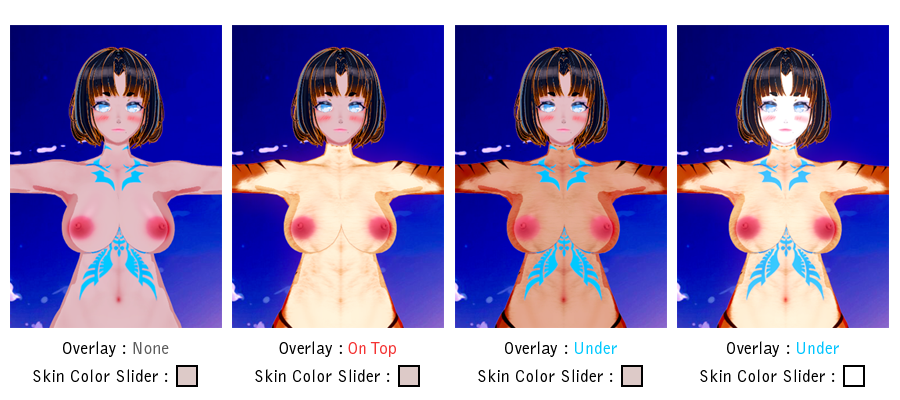

Note: It is possible to use both On Top & Under overlays simultaneously. But you
will get different overlays colors unless you use a solid white skin color
slider to match both overlays.

Since the introduction of KSOX, saving char cards that are using loaded
Body/Face overlays will embed the overlays in the char PNG file.

Note 2: KK by default applies a saturation filter to the whole game. So, things
will look more vibrant. This means that any overlay you create will appear way
more saturated, and sometimes darker in KK.

The way to solve this is by editing the final overlay PNG, to both *desaturate*
& *brighten* it. Then check in the char-maker if it looks good, and continue to
adjust until you find a level of saturation/brightness you like. (I usually
start with -30% saturation and +20 brightness and move from there).

**[Part.2]: Using a 2D editor**

Note: This option comes with a limitation. If you’re using pre-made
illustrations, you can’t display them across UV seams. And since the default
Body UV has seams on its vertical sides, you can only use this method to display
illustrations on the front, or back of the body (or each arm), individually. You
can’t, for example, have a tattoo that is across the right or left sides of the
hips. Because it will be distorted across the seams there.

In this part, you won’t be using 3DC at all. You will only be importing an
illustration, and adjusting it to the correct location on the body/face. We will
only go over doing this for the body. But the same steps apply for the face.

**Step 1:** Now to start with, you need a pre-made illustration. It can be
something you downloaded, or something you made in a 2D editor. For example, we
will be using a tattoo downloaded from google.

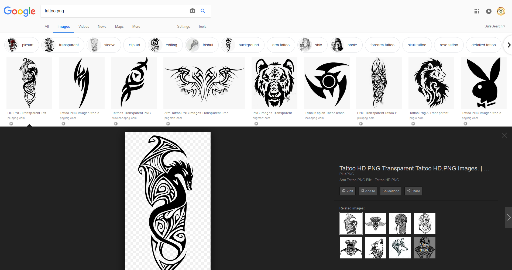

**Step 2:** Open your 2D editor of choice (I am using Photoshop). And open the
“Body UV.PNG“ file I included.

**Step 3:** Import your downloaded tattoo into the 2D editor. And proceed to
resize and place it anywhere on the UV wireframe. I copied the tattoo on the
front body and right back thigh, and gave them some gradient colors.

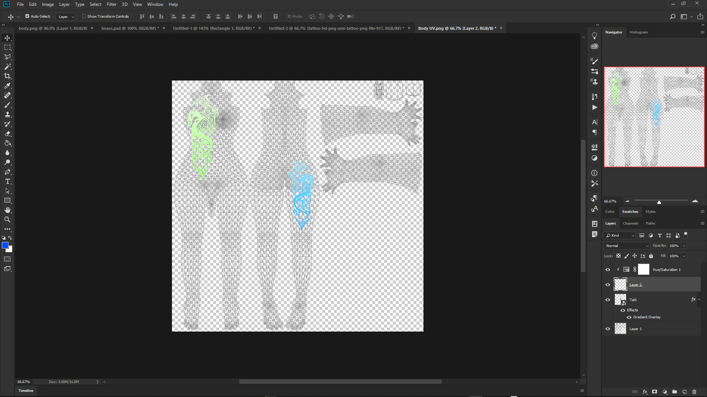

Note: You can place as many tattoos as you want. Edit their color, rotation,
transparency, etc. As long as you keep every individual tattoo contained inside
each of the UV wireframe segments. If you cross the empty space between
wireframe segments, you will have clipping and the tattoos won’t align.

**Step 4:** Hide or delete the Wireframe layer (otherwise the wireframe will
appear in the overlay), then save your current file as a new PNG, for example
“Body 01.PNG”.

Note: The same steps apply for creating a Face overlay in 2D. Only, you will be
opening “Face UV.PNG” instead.

**Step 5:** Load up KK, and open the Female editor. Then navigate to “Overlays”.

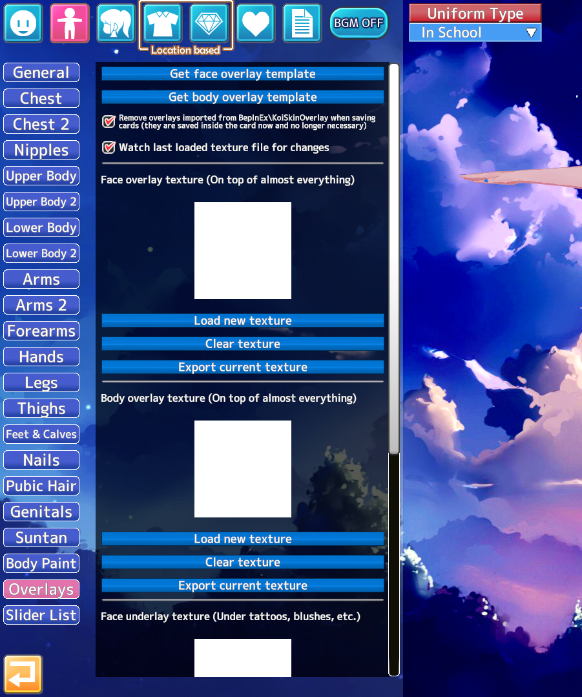

**Step 6:** You have to choose between the two options we discussed at the start
of the tutorial. Either load the body overlay into “Body overlay texture (On top
of almost everything)”. Or into “Body underlay texture (under tattoos, blushes,
etc)”. Browse to the “Body 01.PNG” file you saved.

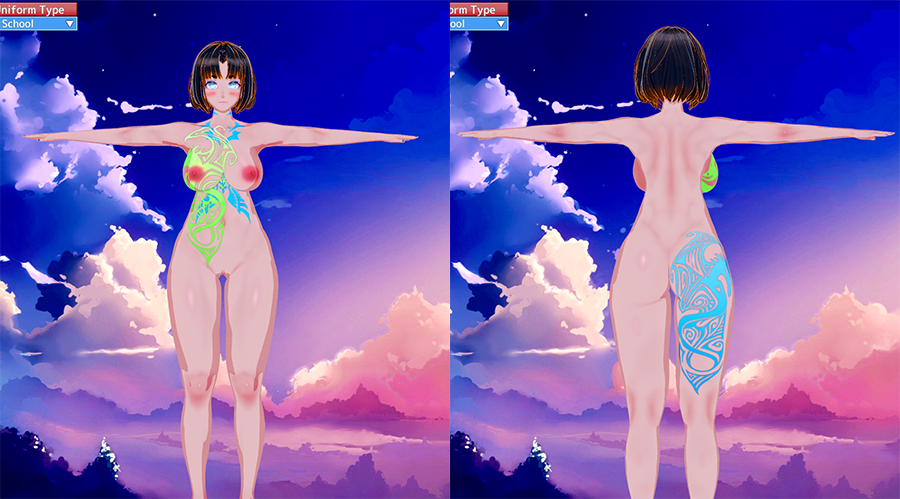

I chose the “On top” option. So, the body overlay tattoos actually cover the
char-editor own tattoos. And will keep its own original color without being
affected by the skin color.

Note: You can make as many edits to the same PNG file as you want in your 2D
editor, the changes will automatically be updated in KK every time you save to
“Body 01. PNG”, as long as you keep the same char open in KK. Once you save the
char PNG file, it will no long be affected by changes to the original “Body 01.
PNG”, you need to reload the body/face PNGs to update them in that case.

**[Part.3]: 3D Coat Basics**

The trick to 3D painting, is that you need to use the female body and face 3D
models in a software capable of painting on the UV directly in 3D. That way,
anything you paint in 3D, will use the models’ default UV wrapping, and it will
display perfectly ingame. To do that, you can start by extracting the body and
face 3D models from KK’s unity3D files. But for the sake of simplicity, I’ll
provide a 3D Coat file with the body and face already setup and aligned.

Note: For this tutorial, we will be using 3D Coat (3DC), a dedicated 3D
sculpting/painting software. I am personally using 3D Coat v4.8.23. The same
basic principles apply to most other 3D editors that allow 3D painting. With
some variation.

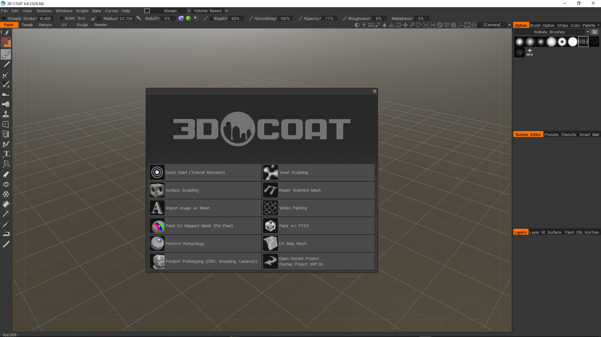

This is the screen that greets you when you first open 3DC.

For this tutorial, you won’t be importing your own 3D models to paint on, but
since it’s worth knowing how to, I’ll briefly go over it. For that you would
select Paint UV Mapped Mesh (Per-Pixel)

Then click the Folder Icon to start browsing for models to import into the
editor.

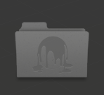

You will then need to adjust the model import configuration, this is what I use:

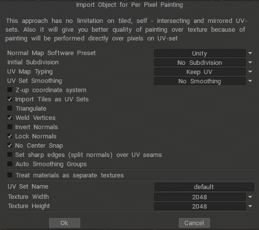

The only thing worth elaborating on is the Texture Width x Height. It’s always a
1:1 ratio, and the overlays work with 1024x1024px by default. However, you could
go up with multiplies of x2 if you wish. But I haven’t tested whether the
difference in quality is there or not once KK loads up the overlays. So, upscale
at your own discretion. If you do this step yourself, you will have to manually
move the head model to align it to the body. You will need to use the Tweak
panel for that, but I would rather not get into that in this tutorial, in order
to keep things simple.

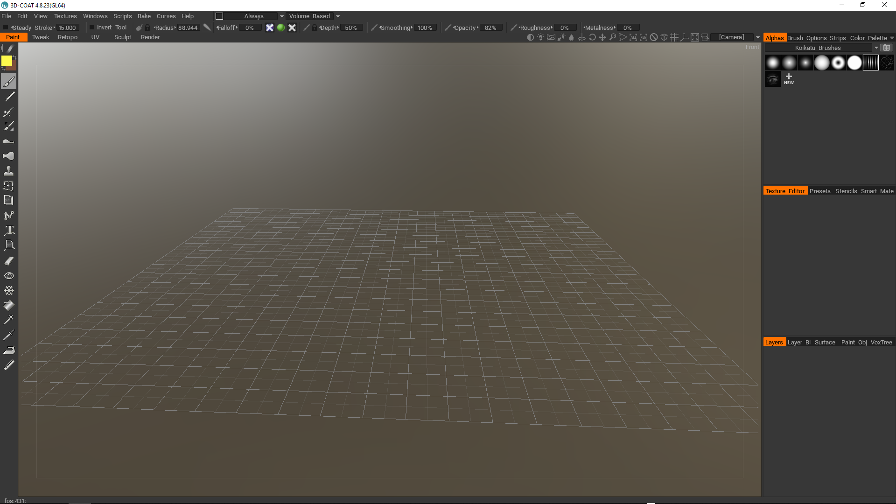

This is the default interface that you will be working with. There are a couple
of things we want to tweak to make life easier.

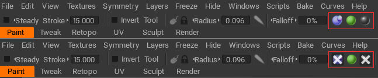

First, you’ll want to disable both of these brush options. Brushes have 3
options here: Depth, Opacity, Glossiness, In that order. Both Depth and Opacity
can paint 3D rendered colors, by adding gloss and/or depth to the brush, but
neither gloss nor depth can be displayed in overlays. So, you’ll only want
Opacity to be enabled. You can set opacity to any value between 0% - 200% to
change the transparency of the brush you’re using.

Next, you’ll also want to tell 3DC which 2D editor you are using. It is
configured to Photoshop by default. But you can change it to other 2D editor
(Gimp, paint.net, etc).

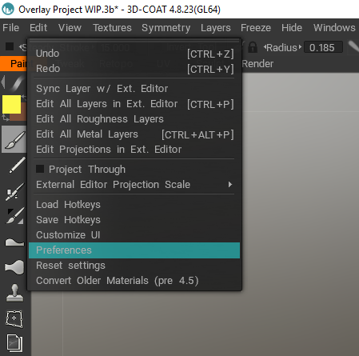

Navigate to Edit\>Preferences.

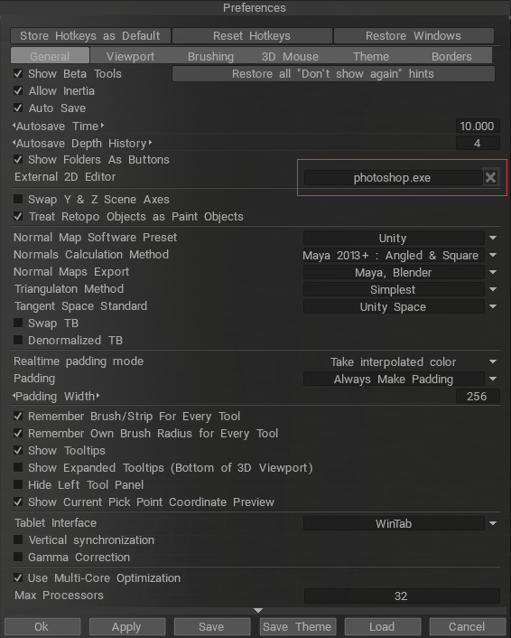

Click the button on the right of “External 2D Editor” and browse to the exe of
the 2D editor you want to use. Proceed to click “Apply” and “Ok”.

Now, let’s discuss some of the fundamental elements in 3DC’s interface.

First of all, *navigation*. The way you can control and navigate the viewport in
3DC is a little different from Blender. While the cursor is in empty space (NOT
on the 3D model): holding Right Mouse Button and moving back and forth will zoom
in and out. Holding Middle Mouse Button will pan the screen. And holding Left
Mouse Button will rotate the screen.

However, if you have a tool, like the Brush selected, while the cursor is in
used space (on top of the 3D model): holding Right Mouse Button and moving right
and left will change the radius of the tool. Moving up and down will change the
tool’s depth (You don’t really use depth to make Overlays, since it’s a flat 2D
texture).

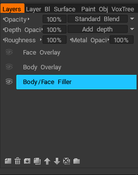

This is the *layers* panel. Somewhat similar to the one in photoshop, but with
more limited functionality.

In the file Template.3B, I included 3 base layers. The first layer Body/Face
Filler includes the grey matte filler color you can see on the model’s body. If
you toggle the eye icon on the left of the layer’s name, it will toggle its
visibility in the editor. And if you hide the Body/Face filler, you won’t be
able to see the body at all, since you hid the only visible texture on it but
you can still color on top of it). The ideal way to work here, is to make any
individual modification in separate layers. For example, I’ve included Body
Overlay & Face Overlay as empty layers. You can paint in them, add details to
them individually, or delete them and create your own layers (you can create as
many as you want). In the end, you will export everything that is visible as a
single PNG for the face, and as a single PNG for the body. But having separate
layers allows you to edit them individually at any point.

Note: Be careful which layer you’re currently selecting (which layer is
highlighted), because that’s the layer you’re painting in.

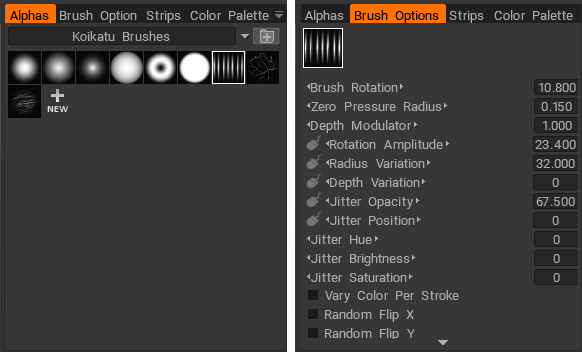

In the top right you have a few tabbed panels*: Alphas, Brush Options, Strips,
and Color Palette*. For this tutorial, we’re only interested in the first two.

*Alphas* allows you to choose the shape of the brush you will be using to paint
directly on the model. You can use the drop menu to switch to different brush
packs or even create your own.

*Brush Options*, has a similar panel to Photoshop’s Brush Settings, as well as
other photo editors. This panel allows you to configure some modifiers that
affect the behavior of the brush.

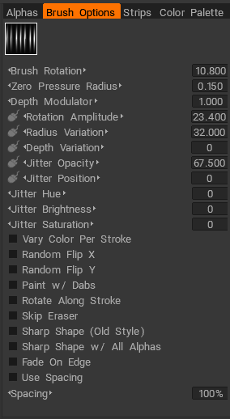

If I expand the *Brush Options* panel vertically, you can see the full list of
possible modifiers. If you’re going to paint your own Overlay, you should
experiment with the different modifiers to find the configuration that suits the
look you’re going for. However, I will describe a few of the main modifiers you
will be using a lot.

*Brush Rotation:* Controls the rotation of the base brush.

*Rotation Amplitude:* Controls the rotation variance as you continue to move the
brush.

*Radius Variation:* Controls the brush size variance as you continue to move the
brush.

*Jitter Opacity:* Controls the opacity/transparency of the brush variance as you
continue to move the brush.

*Jitter Hue:* Will randomize the hue of the chosen brush color within the radius
that you specify as you continue to move the brush.

Note: To further clarify, when you set a value for any of the previous
modifiers, you’re specifying a radius. So, if you set Radius Variation to 32.0,
for example, the brush size will start at the size you specified in the Radius
in the top tool bar. It will then randomly adjust within 32.0 points of the base
value between brush strokes.

This is your *tools* panel on the far left. There are a variety of tools you can
use to paint on or manipulate the existing pixels in any of your layers. For the
most part, though, you will only be using a few of them for the simple task of
painting an overlay.

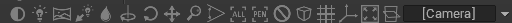

In the top right, there is a variety of camera and view port options. You can
experiment with each of them, but we’re only interested in one of them. The
first icon from the right, is the *Reference tool*, if you click it and further
click *Edit Image Placement*, this will open the Reference Images panel. 3DC
allows you to display a reference image in the editor to help guide you, if
you’re trying to recreate a look or appearance from another
photo/screenshot/etc.

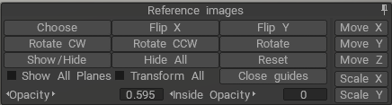

This is the *Reference Images* panel. You can use “Choose” to browse for the
image you want to use as a reference. Most of the configurations here are pretty
self-explanatory. They only affect the reference image you previously selected.

Note: “Opacity” controls the opacity of the reference image itself. While
“Inside Opacity” controls the opacity of the 3D model part that is currently
displaying on top of the reference image.

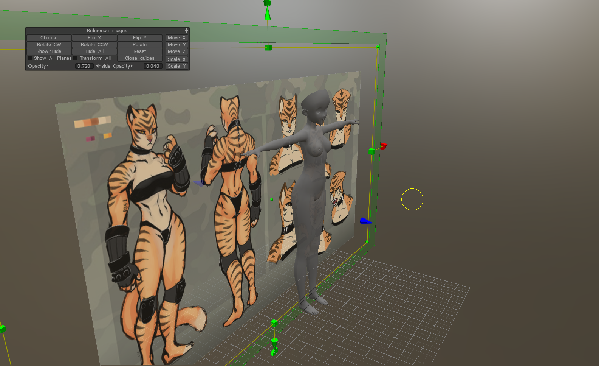

You can use the bounding box arrows/blocks to manually adjust the reference
image’s location/size, or you can use the list of modifiers in the Reference
Images panel (Move X, Move Y, etc).

At any point you can use Show/Hide to toggle the visibility of the reference
image.

You don’t have to use this feature at all, but if you’re painting your own
overlay, it helps to have a reference picture to help guide you.

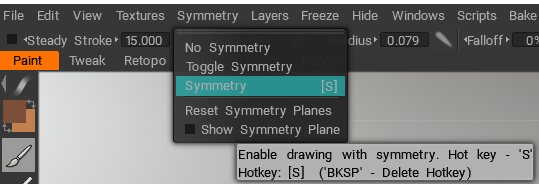

Next on the list is the Symmetry panel. You can summon it by either navigating
to Symmetry\> Symmetry or just pressing (S).

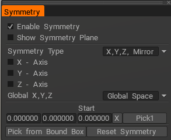

Doing so displays the Symmetry panel. Which allows you to mirror your brush work
on the model automatically, in X, Y, Z, planes.

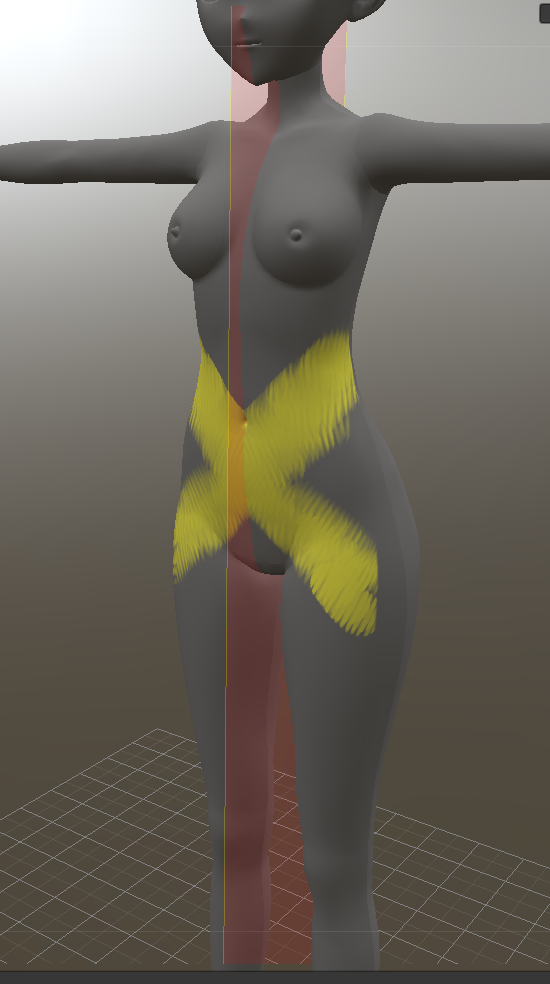

For example, if you apply the X – Axis symmetry, anything you paint on the right
side of the Symmetry Plane will automatically mirror on the left side.

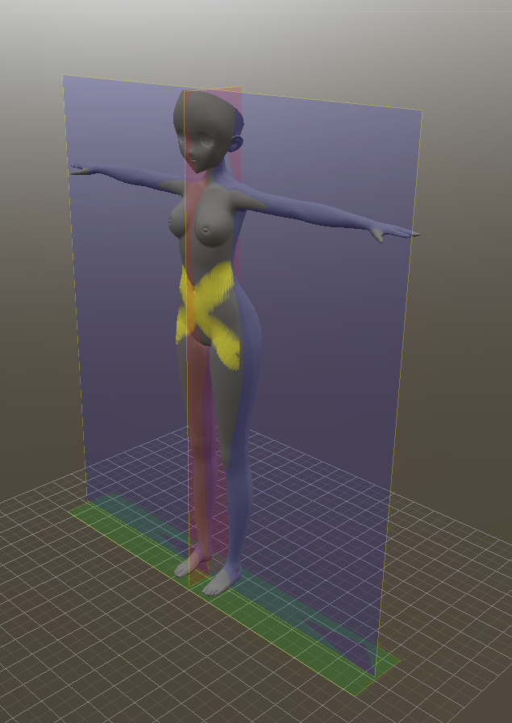

The X Plane (blue) splits the model to left and right.

The Y Plane (green) splits the model to top and bottom.

The Z Plane (Blue) splits the model to front and back.

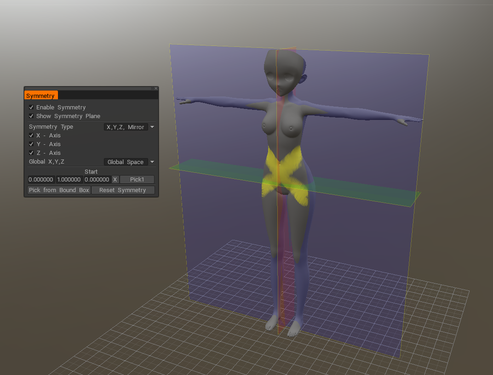

You can use the modifiers under “Start” to offset and move the point where the
planes are split. There are 3 values, for X, Y, Z, respectively. For example, if
you set the second value (Y) to 1.0, it will move the Y plane (green) to the
hips, when it starts by default under the feet.

You can use “Enable Symmetry” to toggle symmetry functions on and off at any
point. You can also choose whether or not to display the colored X Y Z planes
with “Show Symmetry Plane”. They are only visual guides.

With this knowledge, you can start by opening the Template.3B file, and start
experimenting with the brush tools and different brush alphas to paint different
overlays for the body/face.

The thing it keep in mind, is to keep the different elements on separate layers
for later edits. For example, I kept the tiger stripes in a separate layer from
the tiger fur. The number of layers doesn’t matter in the end, as they export to
a single merged PNG.

Now, there is no specific way to do this, as it’s just personal preference in
how to and which brushes to use to paint your overlay with. I could make a
detailed guide for this part later, if it’s requested. But let’s assume you’ve
painted your own overlay. And ended up with something similar to this.

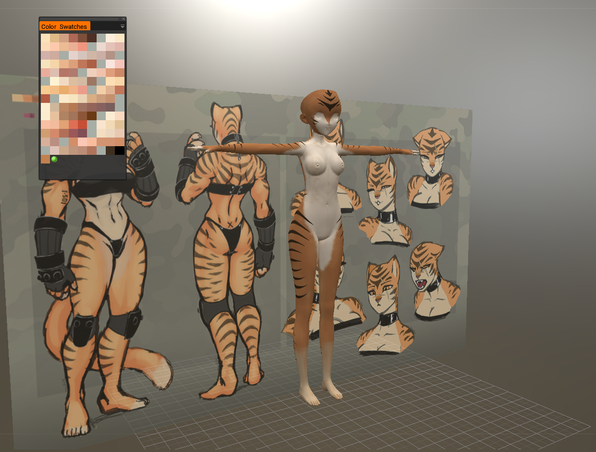

There are two mechanics worth knowing at this stage. Making direct layer edits
in your 2D editor while in 3DC. And exporting all of this for KK.

**Editing in 2D:**  
  

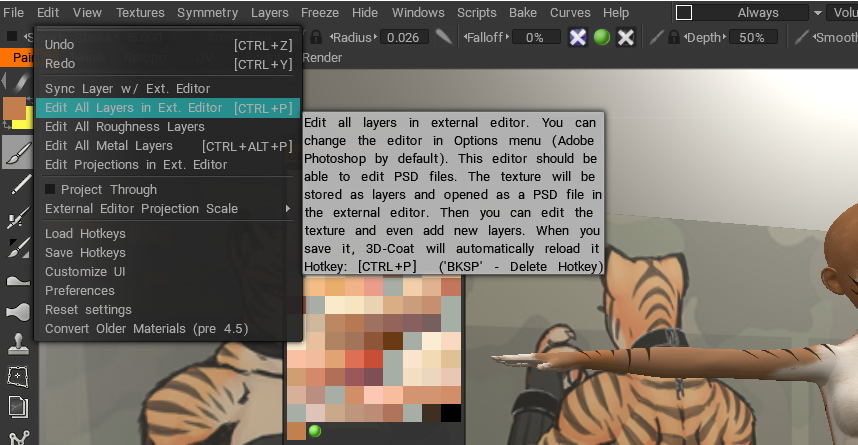

3DC supports live editing in an external 2D editor. So, go to Edit\>Sync Layer
w/ Ext. Editor or, Edit\>Edit All Layers in Ext. Editor (ctrl+P). The first
option, will load the layer that is currently highlighted in the layer panel,
inside of your 2D editor (Photoshop in my case). The second option will open ALL
the layers in your 2D editor.

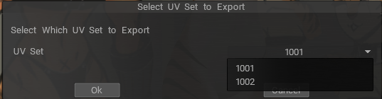

When you choose either of them, this window will pop up. Basically, it’s asking
you which UV set are you currently editing. The body (1001) has its own UV, and
the face (1002) has its own UV, so you can’t edit them both at the same time.
So, say you’re editing the body in Photoshop first, you would select 1001 and
hit Ok.

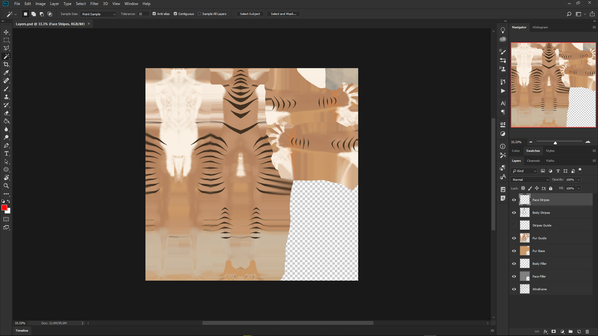

All the layers in 3DC are going to open in a new photoshop file. If you make an
edit to any of these layers and save (ctrl+s), it will automatically change in
3DC. This is useful if you want to add quick photo filters, small details, or
fix any minor pixel issues. As it’s much easier to do that in a dedicated 2D
editor. When you’re done editing, save and close the window in your 2D editor.

Note: The same rules for 2D editing apply here. If you cross the UV wireframe
seams.. you will get distortion and visual problems. So, keep any additions to
each individual UV segment (front body, back body, etc).

**Exporting:**

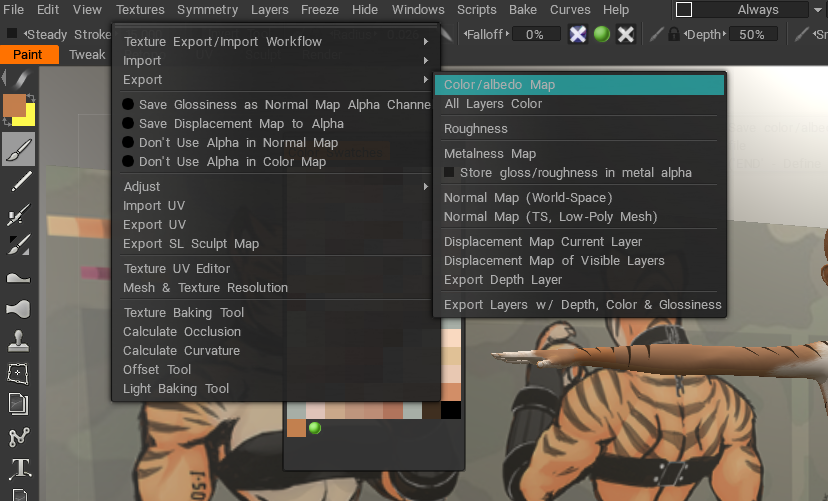

When you’re completely done, make sure you’re only keeping the 3DC layers
visible that you won’t to appear in your texture. Navigate to
Textures\>Export\>Color/albedo Map.

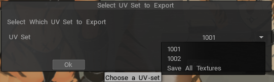

You will then see a similar pop window to earlier. KSOX can only correctly load
the layers for body and face when they are separated. So, you’re going to do it
one at a time. First export 1001 for the body layer. And then export 1002 for
the face layer.

You can export in a variety of formats, but for KSOX, we will use PNG.

That’s it. Load your body and face textures separately into your chosen
character in KK, and voila!

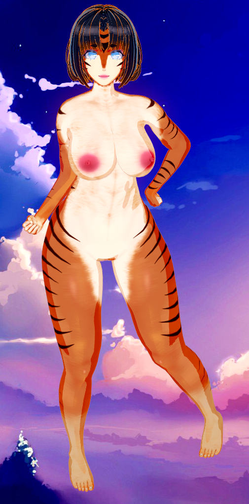
